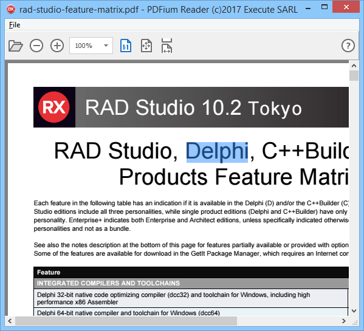
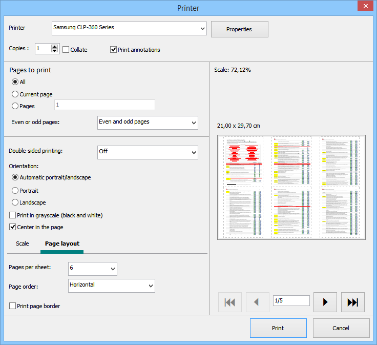

# PDFiumReader
Sample Delphi PDF reader based on PDFium

I don't use PDFium.dll anymore, but my own libPDFium.dll library build from the original PDFium source code

since June 16, 2020, there's a custom print dialog box

